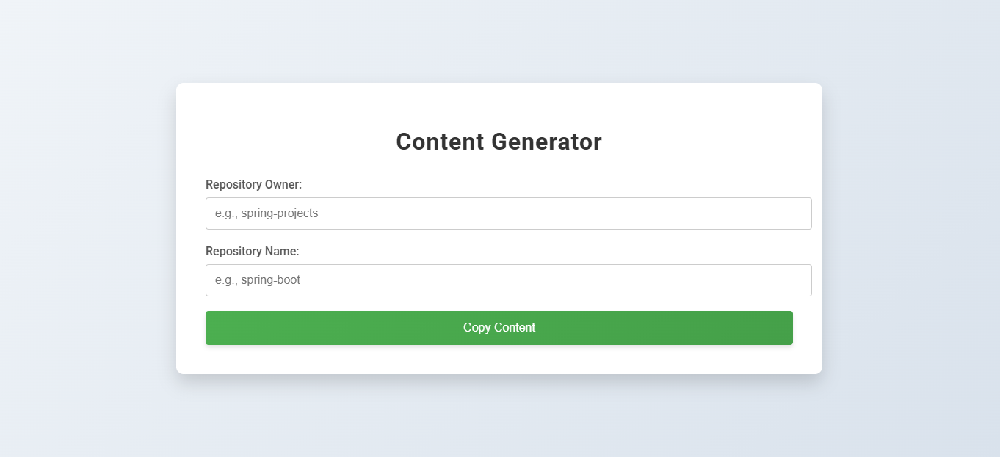
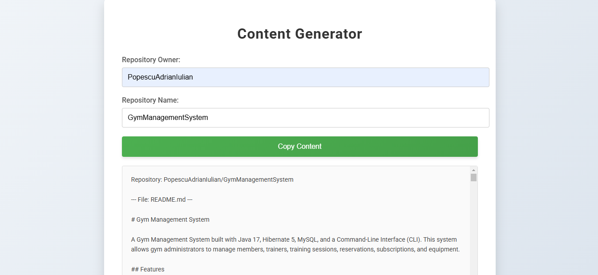

# Repository Content Generator

## Description
**Repository Content Generator** is a Spring Boot web application that fetches and concatenates repository content from GitHub. This tool helps developers quickly view and aggregate content from multiple files in a GitHub repository, making it easier to analyze codebases and generate documentation.



## Features
- Fetch content from any GitHub repository using its owner and name.
- Optionally exclude specific files from the content fetch process (e.g., `.gitignore`, `.vscode`).
- Concatenate content from all the files in the repository for easy viewing.
- Simple and clean user interface for interacting with the application.



## Technologies Used
- Spring Boot 3.4.3
- GitHub API
- Java 17
- HTML, CSS for the frontend

## Setup and Installation

1. Clone the repository:

   ```bash
   git clone https://github.com/PopescuAdrianIulian/RepositoryContentGenerator.git
   ```

2. Navigate to the project directory:

   ```bash
   cd RepositoryContentGenerator
   ```

3. Make sure you have Maven installed and configure your environment to use Java 17.

4. Set your GitHub token and excluded files in the `src/main/resources/application.properties` file:
   ```properties
   github.token="YourGitHubTokenHere"
   excluded.files=.idea,.mvn,.png,.gitattributes,.gitignore,.vscode,mvnw,mvnw.cmd
   ```

5. Build and run the application using Maven:

   ```bash
   mvn clean install
   mvn spring-boot:run
   ```

6. Access the application by navigating to `http://localhost:8080` in your browser.

## Usage
1. Enter the GitHub repository owner and name in the input fields.
2. Click the "Copy Content" button to fetch the content.
3. Once the content is loaded, you can view it in the result area or copy it to your clipboard using the "Copy Result" button.

## Endpoints
- `GET /fetch-all?owner={owner}&repo={repo}`: Fetches the content of all files in the specified GitHub repository.


